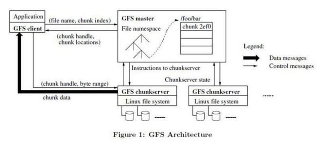

# GFS

## Intro

### why

* 组件失效被认为是常态事件,而不是意外事件
* 文件巨大
* 多数修改都是文件追加而不是覆盖

## 概述

### 架构

* 一个Master 节点
* 多台Chunk 节点



### Chunk

64M,从元数据数量 操作次数等方面设计较大的chunk,但是chunk过大带来热点问题.

### 元数据

所有的元数据都保存在 Master 服务器的内存中,Master 服务器在启动时,或者有新的 Chunk 服务器加入时,向各个 Chunk 服务器轮询它们所存储的 Chunk 的信息

* 文件和 Chunk 的命名空间
* 文件和 Chunk 的对应关系
* 每个 Chunk 副本的存放地点 版本号

### 操作日志

操作日志包含了关键的元数据变更历史记录(文件 命名空间 Chunk),作为判断同步操作顺序的逻辑时间基线

定时将日志压缩为 Checkpoint,恢复状态仅需要最新的Checkpoint 以及后续的日志

### 一致性模型

|   操作   |       写       |       追加       |
| :------: | :------------: | :--------------: |
| 串行成功 |     已定义     | 已定义部分不一致 |
| 并行成功 | 一致但是未定义 | 已定义部分不一致 |
|   失败   |     不一致     |      不一致      |

对于修改操作的文件范围 region:

* 一致: 客户端从哪个副本读取`region`都是相同结果
* 已定义: region 一致 并且立刻看到写入的所有内容

经过了一系列的成功的修改操作之后,GFS**最终会**确保被修改的文件 region 是已定义的,并且包含最后一次修改操作写入的数据

串行写
并行写 : 并发写入无法保证顺序 只能保证所有节点顺序一致
串行追加 : 中间过程出现某几个节点失败,重试,最终部分已定义,但是失败部分不一致
并行追加

## 系统交互

最小化所有操作和 Master 节点的交互

### Lease 和 变更顺序

* 变更 ： `写操作` 或者 `追加操作` 修改 Chunk
* 租约 :  Master 设置给某个 Chunk Server
* 主Chunk : 被设定了租约的Chunk 的一个副本


```shell
1. client 询问 master chunk
2. master 返回 chunk标识符及其副本, client 缓存这些信息 以便之后使用,直到信息过期或者主Chunk表示其已经不再持有租约
3. client 向所有的 chunk server 推送数据操作
4. client 推送完成后,告知主 Chunk 开始写入,主 Chunk 所在服务器为所有操作生成连续序号(可能来自不同的 client,序号保证了操作的顺序执行),按照需要顺序执行操作并更新状态
5. 主 Chunk 将写请求传递到二级副本并提供序号，二级副本按照序号顺序执行操作
6. 回复主Chunk 写入完成
7. 主 Chunk 告知 Client 写入结果
```

* 涉及到 *多个Chunk 的操作*会被分割成多个操作
* 如果一次追加长度超过 Chunk 的剩余长度 也会被分割成多个操作

### 数据流

线性推送 而不是树形推送

### 原子追加

* 客户机指定写入数据
* GFS 追加 并返回偏移量
* 追加结果可能失败,Client 重新发起追加 例如 A B C三个副本 第一次追加 data B 失败了,会再次追加一次,虽然 部分（第一部分）不一致,但是成功部分（第二部分）是define的,Client 获取到的offset 也是一样的
  1. A : data ,B : * , C : data
  2. A : data data ,B : * data, C : data data

### 快照

Copy On Write 实现快照

1. 取消文件租约
2. 快照文件与源文件指向相同的Chunk
3. Client 写入 Chunk 时,由于租约过期,首先访问Master,Master 发现 这个Chunk 被引用两次（源和快照）Master 命令所有Chunk Server 创建 新的Chunck
4. Master 为这个新的Chunk 创建租约
5. Client 写 新的Chunk

## Master操作

### 命名空间管理和锁

命名空间并不是完整的文件目录,仅仅是查找表,通过前缀压缩,形成树状结构

### 副本位置

* 最大化数据可靠性
* 最大化网络带宽利用率

### Chunk 创建 复制 负载均衡

创建策略:

* 最低硬盘使用率
* 最低负载
* 尽可能分布在多个机架

复制策略:

当一个Chunk **有效** 副本数量小于用户指定的复制因数时,Master 节点会复制它

负载均衡: 周期性的对副本调整

### GC

惰性垃圾回收

### 过期副本

版本号

## 容错和诊断

### 高可用

* 快速恢复
* 复制

## Reference

* [GFS 一致性总结](https://blog.csdn.net/qiaojialin/article/details/71574203)
* [深入浅出Google File System](https://www.jianshu.com/p/58cb14cc1199)
* [The Google File System 论文笔记](https://juejin.im/post/5d9dc4d2e51d4578453274cd)
* [Google File System 论文解读](https://juejin.im/entry/5d8b068a518825096a1868d4)
